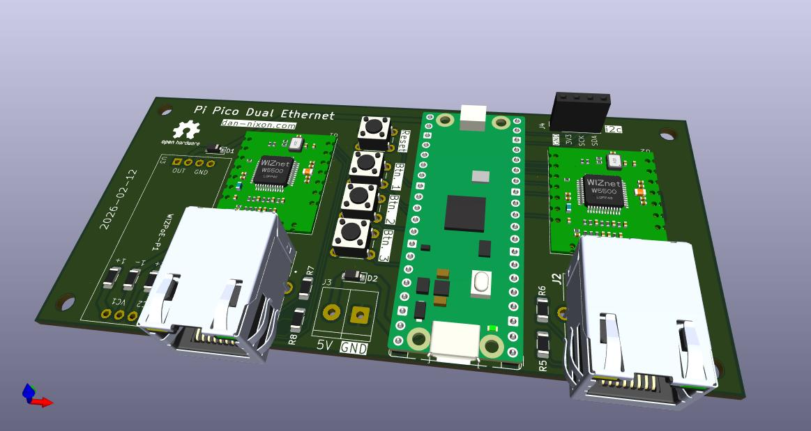
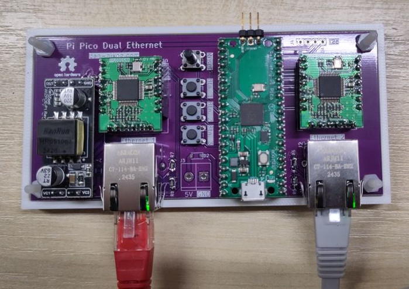

# Pi Pico Dual Ethernet

Pi Pico x 2 W5500 driven Ethernet interfaces (one of which is PoE).

Designed with the intention of being a IO/OT gateway for a CNC machine.
May actually have other uses.

Pinout can be found in the [demo firmware](./demo-firmware/src/main.rs).

